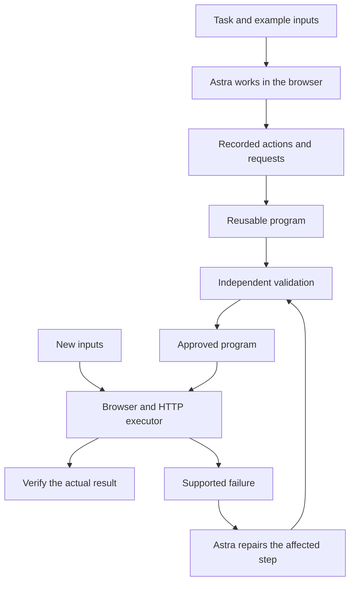

# Myelin

**Myelin turns work that Astra learns once into automation you can reuse.**

Myelin lets Astra learn a browser task once, turn it into a checked program, and reuse it on new inputs, with verification and repair built in.

For example, Astra creates a Trello card with a description, due date, and checklist. Myelin records the successful steps, builds a reusable program, and tests it on new inputs. You can then run the same workflow for more leads.

If a supported page change breaks the program, Astra can repair the affected step. The repair must pass validation before it becomes the active version.

Myelin is useful to make AI use far more efficient by using Astra for a new task once and then using deterministic programs to execute that task again with new inputs to preserve costs. You pay for learning and repair; routine execution can then run without further model calls.

> Learn once. Check the result. Reuse the program.

[Watch the 1-minute demo](docs/media/live-demo.mp4) · [Live evidence](docs/live-evidence.md) · [Original demo](docs/media/demo.mp4)

## How it works

| Step | What Myelin does |
|---|---|
| Learn | Astra completes the task in a browser while Myelin records actions and observed requests. |
| Build | Turns the successful run into a typed program with reusable inputs. |
| Validate | Checks the program on new inputs before making it active. |
| Reuse | Executes the program through browser actions and supported HTTP operations, with zero model calls. |
| Repair | Asks Astra to fix a supported failure, then validates the new version. |

## Architecture



Myelin records each intended write before sending it. If the result is uncertain, it stops and reads back the app state before deciding how to continue.

Program versions are immutable. Each version keeps its own hash and supporting evidence.

## What we demonstrated

- **Real Trello workflows:** sales follow-up and onboarding with descriptions, due dates, and checklists.
- **Fresh execution:** a new Trello task completed in **20.765 seconds**, with **zero model calls** and **16 of 16 checks passing**.
- **Batch reuse:** five example leads completed, with repeated submissions returning the existing results.
- **Repair:** one Astra call fixed an induced locator failure, followed by validation on two fresh inputs.
- **HTTP optimization:** one observed checklist write replaced its browser interaction and passed two fresh validation cases.
- **Another site:** public-page extraction used the same runtime through configuration.
- **Regression checks:** 102 tests passed and 54 existing program hashes stayed unchanged.

The original CRM and expense demos are also available. New websites need session setup, a defined workflow, and independent result checks.

## How Astra fits the project

| Judging criterion | What we built and how to show it |
|---|---|
| **Astra in Development** | We worked with Astra to design the runtime, implement features, debug live browser failures, and validate changes. The build log and development evidence document that work. |
| **Astra in Project** | Astra teaches and repairs workflows. Myelin converts successful work into reusable programs. The original demos also demonstrate native async tools, live steering, and hosted patching. |
| **Live Demo** | The video shows a real Trello task executing, verified results, batch reuse, recorded learning, and the implementation. |
| **Technicality** | Typed programs, immutable hashes, independent checks, durable write tracking, validated promotion, scoped repair, and recorded cost evidence support the demo. |

[Development evidence](docs/development-evidence.md) · [API capability evidence](docs/api-capabilities.md) · [Build status](docs/build-log/SUMMARY.md)

## Run locally

Requires Python 3.12+ and uv.

```sh
uv sync --locked
cp .env.example .env
uv run playwright install chromium
```

In `.env`, set `OPENAI_API_KEY`, enable `MYELIN_LIVE=1` for Astra learning and repair, and set `MYELIN_DEMO_TOKEN` to a random local value. `OPENAI_BASE_URL` defaults to the official API address. The other demo credentials are synthetic target-app logins.

Start each service in a separate terminal:

```sh
make crm
make expense
make serve
```

Open [localhost:8100](http://localhost:8100) for the original demos. Use `/live` for connected browser workflows.

Follow the [live runbook](docs/live-runbook.md) to configure your browser session and workflow. Authentication, private plans, and raw run data stay outside the public repository.

Learning and repair use the model API. Approved program execution uses zero model calls.

```sh
uv run pytest -q
uv run ruff check .
```

[Demo runbook](docs/runbook.md) · [Live runbook](docs/live-runbook.md) · [CRM contract](docs/crm-contract.md) · [Oracle specification](docs/oracle-spec.md)

MIT license.

## Keywords

AI agents · browser automation · workflow automation · agentic AI · program synthesis · learning from demonstration · reusable skills · computer use · LLM agents · self-healing automation · verification · deterministic execution · human in the loop · observability · agent memory · task replay · scoped repair · independent validation · durable execution · idempotency · checkpoint recovery · immutable programs · typed programs · trace provenance · API optimization · batch processing · cost tracking · GPT-6 Astra · Astra · OpenAI · Python · Playwright · FastAPI · Pydantic · SQLite · HTTP · WebSockets · native async tools · live steering · hosted patching · Trello · CRM · expense automation
