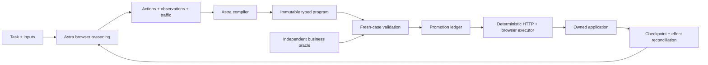

# Myelin

**Give Myelin a task. Astra figures it out once; Myelin turns the successful run
into a checked program that can execute again without model calls.**

If the app changes, Myelin reconciles any writes, returns to the relevant browser
checkpoint, asks Astra for a local repair, and validates the new program before
promotion. The saved program—not permanent model memory—is the reusable artifact.

The current working example creates and pays invoices in an **owned local CRM**.
It is not a demonstrated connector to arbitrary live CRMs. The CRM makes correct
amounts, duplicate writes, missing payments and controlled app changes independently
checkable. A second owned expense SPA now exercises bearer authentication,
typed branches and an independent expense oracle.

## What works

- Visible model-led browser execution with per-action frames and request provenance.
- Model-authored typed programs combining browser actions with observed HTTP calls.
- Fresh cookies, CSRF and response-derived entity URLs on each run.
- Eight independent business checks, immutable candidates and a promotion ledger.
- New-input execution with zero model calls, UI-move resilience, local field-contract
  repair, and applied-write/lost-response reconciliation.
- A live console showing source-linked steps, validation and measured usage.

The `core-demo` tag preserves two successful core rehearsals. A full CRM gate has
also passed eight program and eight fresh AI reference runs, with native async
validation and an accepted reasoning-effort update. Full completion still requires
expense model compilation, live steering, hosted compiler tools and final artifacts. Mock tests are never presented as live capability evidence.
See [verified build status](docs/build-log/SUMMARY.md) and [run evidence](docs/demo-evidence.md).

## Run locally

Requires Python 3.12+, uv and Playwright Chromium.

```sh
uv sync --locked
cp .env.example .env
uv run playwright install chromium
```

Fill OPENAI_API_KEY and set MYELIN_LIVE=1 in `.env`. Leave OPENAI_BASE_URL blank
for the official API; use a custom address only if your event supplies a gateway.
Set MYELIN_DEMO_TOKEN to a random local value for the internal demo controller.
Synthetic login credentials are separate from the model API key.

Start these in separate terminals:

```sh
make crm
make expense
make serve
```

Open the console at http://localhost:8100. Then:

```sh
uv run pytest -q
uv run ruff check .
uv run python scripts/hello.py
uv run python scripts/demo.py --assert --core
```

`--stage` pauses between demonstration beats. Core mode never claims full completion.
Runs, screenshots, app databases, environment secrets and private planning files
are ignored. The demo resets isolated tenants and preserves candidate/history
artifacts. See the [runbook](docs/runbook.md) for recovery and replay rules.

## Architecture



The model/program tool surface cannot access test-administration endpoints or app
source/DB files. The independent oracle verifies a finite locked suite; it cannot
prove arbitrary-task equivalence. Work units count HTTP requests plus ten times UI
actions. They are not dollars. Model cost uses recorded response usage and dated
pricing, with unknown values retained when evidence is insufficient.

[CRM contract](docs/crm-contract.md) · [Oracle specification](docs/oracle-spec.md) ·
[API evidence](docs/api-capabilities.md)

MIT license.
