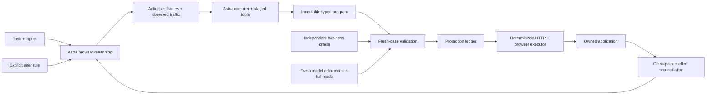

# Myelin

**Give Myelin a task. Astra figures it out once; Myelin turns the successful run
into a checked program that executes again without model calls.**

When an app changes, Myelin reconciles earlier writes, resumes at a browser
checkpoint, asks Astra for a local repair, and validates the candidate before
promotion. The reusable artifact is a typed program with source-linked evidence.

[Watch the one-minute demo](docs/media/demo.mp4) ·
[Build and gate evidence](docs/demo-evidence.md) · [Runbook](docs/runbook.md)

## Supported workflows

| Owned app | Task | Architecture |
|---|---|---|
| CRM | Create an invoice and mark it paid | Server-rendered forms, cookies, fresh CSRF |
| Expenses | Create and submit an expense | JSON SPA, fresh bearer auth, response-derived IDs |

These two integrations demonstrate the reusable recording/compiler/executor design.
They do **not** establish compatibility with arbitrary online CRMs. A new service
needs authentication/session integration, workflow scope and independent outcome
checks. Only synthetic local data is used here.

## What works

- Model-led browser execution records each action, frame, request and response usage.
- Astra compiles observed traffic into typed HTTP operations with necessary UI steps.
- Immutable programs pass independently authored business checks before promotion.
- New inputs execute with zero model calls; field changes can trigger scoped repair.
- Both apps have full gates with eight program and eight fresh model-reference runs.
- Native async validation retains original call IDs while Astra analyzes dependencies.
- Accepted WebSocket steering becomes `amount_cents > 50000`, with explicit provenance
  and passing below/equal/above cases. Submission remains a single common suffix.
- Hosted shell analyzes sanitized uploaded traces; staged patches pass a gate before
  adoption. A real effective-reasoning-effort update has recorded API evidence.
- The console shows source frames, program steps, branch coverage, ledger decisions
  and measured costs. Completed history survives restart.

The `core-demo` tag preserves the Phase 4 milestone. Later integrations retain it.
The final budget-conserving rehearsals reuse verified live model evidence and
execute a small set of new tasks with zero model calls. They do not claim new
model-reference runs. See [integration status](docs/build-log/SUMMARY.md).

## Run locally

Requires Python 3.12+, uv and Playwright Chromium.

```sh
uv sync --locked
cp .env.example .env
uv run playwright install chromium
```

Fill OPENAI_API_KEY and set MYELIN_LIVE=1 for model-powered learning/repair.
OPENAI_BASE_URL may remain blank: it defaults to the official API address. Use a
custom gateway only if your event supplies one. Set MYELIN_DEMO_TOKEN to a local
random value. The other demo credentials are synthetic target-app logins.

Start in separate terminals:

```sh
make crm       # target app on 8101
make expense   # target app on 8102
make serve     # Myelin console on 8100
```

Open http://localhost:8100. MYELIN_HEADLESS=1 avoids extra desktop windows while
preserving captured frames. Choose “Learn” to create a program, then “Execute the
current program” for new inputs. The expense full mode learns the explicit note
rule and runs eight model comparisons.

```sh
uv run pytest -q
uv run ruff check .
uv run python scripts/demo.py --assert --core
uv run python scripts/demo.py --assert --full
```

The fresh full command is model intensive. To reuse your already-verified live
artifacts and run only three zero-model smoke tasks, pass `--reuse-evidence` as
shown in the [runbook](docs/runbook.md). `--stage` pauses between engineering beats.
Raw runs, screenshots, databases, environment files and private plans are ignored.
The repository includes selected sanitized evidence and the completed video.

## Architecture



The model's tool surface cannot read target-app source/DB files or call private
administration endpoints. The oracle checks finite locked inputs and invariants;
it does not prove arbitrary-task equivalence. Work units count HTTP requests plus
ten times UI actions. Model-token cost uses dated response usage; unknown cost
stays unknown, and hosted/container charges are separate.

[API capability evidence](docs/api-capabilities.md) ·
[Development fixes and tests](docs/development-evidence.md) ·
[CRM contract](docs/crm-contract.md) · [Oracle specification](docs/oracle-spec.md)

MIT license. Submission artifacts are prepared; event submission is not automated.
